# Real Estate Marketing Platform

A two-tier MongoDB / Express / React listing system with JWT-authenticated CRUD and image upload.

---

## Highlights

- Layered Express REST API with a clean `routers → controllers → models` separation.
- JWT-based authentication on top of bcrypt-hashed credentials, with ownership enforcement on mutating routes.
- Image pipeline backed by multer, served as static assets from the API origin.
- Six composable filter endpoints over the apartment catalogue (category, city, advertiser, bedroom range, price range, single document).
- React 18 SPA built with MUI 5, Axios, and React Router 7.
- Modular monolith — single deployable process per tier, single database.

---

## Key Features

- **Catalogue browsing.** Public listing of apartments with populated city, category, and advertiser details.
- **Composable filtering.** Independent endpoints for filtering by category, city, advertiser, bedroom count range, and price range.
- **Authenticated CRUD.** Advertisers create, update, and delete their own listings. Each mutating route verifies the caller's JWT and matches the URL `codeAdvertiser` against the apartment's owner.
- **Taxonomy management.** Cities and categories are first-class resources with public read access and authenticated creation.
- **Image upload pipeline.** Multipart `POST /Apartment` accepts a single JPEG or PNG image up to 2 MB; uploaded files are served directly by the API.
- **Advertiser accounts.** Sign-up and login flows issue a JWT signed with a server-side secret and a one-hour expiry.

---

## Overview

The platform serves advertisers who need to publish property listings without depending on a paid SaaS portal, and visitors who want to browse and filter those listings. The data model is intentionally aligned with MongoDB's document shape: an apartment carries denormalized references to its city, category, and advertiser, while the related entities maintain back-reference arrays for fast taxonomy reads.

The business problem is narrow and well-bounded — advertisers post, visitors browse — and the system is sized accordingly. There is one database, two deployable processes (API and SPA), and no asynchronous infrastructure. The architecture optimises for operational simplicity over premature horizontal scaling.

At a technical level, the React client speaks to the Express API over HTTPS / JSON. The API authenticates mutating requests via a JWT middleware, dispatches to a controller, performs persistence through Mongoose, and serves uploaded images from a static directory on the same origin. State flow in the client is local React hooks; there is no global store.

---

## Technical Challenges

- **Denormalized back-references.** City, Category, and Advertiser documents each carry an `arrApartment: [ObjectId]` array. The Apartment controller is the authoritative layer for this consistency invariant — every create and delete must `$push` / `$pull` across the three referenced collections in lockstep.
- **Ownership enforcement without a role system.** Update and delete compare the URL `codeAdvertiser` parameter against `apartment.codeAdverticer` (legacy field spelling preserved) before allowing the mutation. This avoids the complexity of a full RBAC layer while still preventing cross-account writes.
- **Multipart upload pipeline.** Multer is configured to accept JPEG and PNG only, with a 2 MB per-file cap. The uploaded path is persisted on the Apartment document and served from `Server/uploads/` via `express.static`.
- **Range filters as REST paths.** Price and bedroom-count ranges are exposed as `/num/:min/:max` and `/price/:min/:max`. The design matches the existing controllers and is intentionally simple; the operational trade-off (loss of optional / composed query semantics) is documented as a future revision.
- **Port collision in local development.** The API hard-codes port 3000; the CRA dev server defaults to the same port and is auto-negotiated to 3001 at startup. Documented in the installation section.

---

## Architecture

### Request Lifecycle

1. The browser invokes Axios through the single HTTP module at `Web/src/Project/api.js`.
2. The request reaches an Express router under `Server/api/routers/`.
3. Auth-gated routes pass through `checkAuth`, which validates `Authorization: Bearer <token>` using the server's signing secret.
4. `POST /Apartment` passes through multer before the controller runs, populating `req.file` with the uploaded image metadata.
5. The controller carries the business logic. It calls into Mongoose models for persistence and is responsible for cascading writes across denormalized references.
6. The response is JSON. Image URLs returned to the client resolve against the API's static mount.

### Backend Layering

- **Routers** are thin: they declare the HTTP verb and path, attach middleware, and delegate to a controller method.
- **Controllers** hold the business logic. They orchestrate persistence, enforce ownership on mutating routes, and maintain the consistency invariant across denormalized collections.
- **Models** define Mongoose schemas, field-level validation, and references.
- **Middleware** (`Server/api/middlewares.js`) centralises JWT verification, multer configuration, and a relationship-existence check.

The dependency direction is one-way: routers depend on controllers, controllers depend on models, and middleware is composed at the router level. No layer reaches back upward.

### Authentication Flow

1. `POST /Advertiser/signIn` accepts credentials, hashes the password with bcrypt, and persists the new advertiser.
2. `POST /Advertiser/login` looks up the advertiser by email, compares the password with bcrypt, and on success signs a JWT with the server-side `SECRET` and a one-hour expiry.
3. The client stores the token and attaches it as `Authorization: Bearer <token>` to subsequent mutating requests.
4. `checkAuth` validates the token signature and expiry. Controllers additionally enforce ownership on update and delete by matching the URL `codeAdvertiser` against the stored owner.

### Persistence Flow

Writes touch the primary `Apartment` document first, then propagate to the referenced City, Category, and Advertiser documents through `$push` (on create) or `$pull` (on delete). The Apartment controller is the single point that maintains this invariant — any future write path must repeat the same cascade.

### Synchronous by Design

There is no job queue, scheduler, or worker process. All request handling completes within the HTTP cycle. This is an operational trade-off at the current scope: the system gains a simpler deployment surface and clearer failure semantics in exchange for blocking the request on every cascade write.

### System Diagram

<!-- Source: docs/architecture.mmd — regenerate with: npx -p @mermaid-js/mermaid-cli mmdc -i docs/architecture.mmd -o docs/architecture.svg -b transparent -->


---


## Usage

The following examples assume the API is reachable at `http://localhost:3000`.

```bash
# Register a new advertiser
curl -X POST http://localhost:3000/Advertiser/signIn \
  -H "Content-Type: application/json" \
  -d '{"name":"Avi","email":"avi@example.com","password":"s3cret","phone":"+972500000000"}'

# Login and capture the JWT
TOKEN=$(curl -s -X POST http://localhost:3000/Advertiser/login \
  -H "Content-Type: application/json" \
  -d '{"email":"avi@example.com","password":"s3cret"}' | jq -r .token)

# List all apartments
curl http://localhost:3000/Apartment

# Filter apartments by price range
curl http://localhost:3000/Apartment/price/2000/4500

# Create an apartment with an image (multipart)
curl -X POST http://localhost:3000/Apartment \
  -H "Authorization: Bearer $TOKEN" \
  -F "name=2BR near the park" \
  -F "description=Renovated apartment, second floor" \
  -F "codeCategory=<categoryObjectId>" \
  -F "codeCity=<cityObjectId>" \
  -F "codeAdverticer=<advertiserObjectId>" \
  -F "numBeds=2" \
  -F "price=3800" \
  -F "image=@./photo.jpg"

# Delete an apartment (ownership enforced)
curl -X DELETE \
  "http://localhost:3000/Apartment/<apartmentId>/<advertiserId>" \
  -H "Authorization: Bearer $TOKEN"
```

---

## Installation

**Prerequisites**

- Node.js 18 or newer
- A running MongoDB instance reachable from the API process

**Server**

```bash
cd Server
npm install
# Create Server/.env
#   LOCAL_URI=mongodb://localhost:27017/Articles_DB
#   SECRET=replace-with-a-strong-secret
npm start
```

**Web**

```bash
cd Web
npm install
npm start
```

The API binds to port 3000. The CRA dev server defaults to the same port and will prompt to use 3001 instead — accept the prompt.

---


## Project Structure

```
.
├── Server/
│   ├── app.js                       # Express entry point, middleware, route mounting
│   ├── api/
│   │   ├── routers/                 # Express routers per resource
│   │   │   ├── Advertiser.js
│   │   │   ├── Apartment.js
│   │   │   ├── Category.js
│   │   │   └── City.js
│   │   ├── controllers/             # Business logic, cascade writes
│   │   │   ├── Advertiser.js
│   │   │   ├── Apartment.js
│   │   │   ├── Category.js
│   │   │   └── City.js
│   │   ├── models/                  # Mongoose schemas
│   │   └── middlewares.js           # checkAuth, multer config, relationship checks
│   └── uploads/                     # Static image storage
└── Web/
    ├── public/
    └── src/
        └── Project/
            ├── api.js               # Axios HTTP client (single module)
            ├── Components/          # Pages and shared components (MUI)
            └── Redux/               # Vendored but unused; see Architectural Decisions
```

---

## Future Improvements

- Migrate the `codeAdverticer` legacy field spelling across the schema, populate calls, and controllers in a single coordinated change.
- Register the missing `/homePage` route on the frontend so successful login lands on a real page.
- Either complete or remove the Redux dependency; the current half-state is misleading.
- Move filters from path segments to query strings to support composition (e.g. price range *and* city).
- Add server-side pagination on `GET /Apartment` before the catalogue grows.
- Replace `express.static("uploads")` with object storage and signed URLs.
- Introduce an integration test suite covering the auth flow and the cascade-write invariants.
- Add request-level validation with Joi or Zod to centralise input checks currently scattered across schema regexes and ad-hoc controller code.

---

## Contributing & Feedback

Issues and pull requests are welcome. For questions or direct feedback, contact `esty41655@gmail.com`.

---

## License

Released under the MIT License. See `LICENSE` for details.
